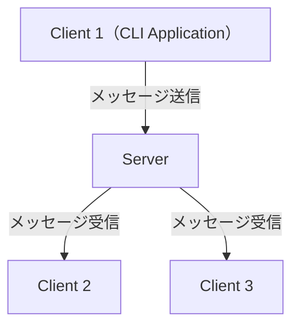

# Engawa

[![Crates.io version badge][crates-badge]][crates-url]
[![MIT license badge][mit-badge]][mit-url]
[![GitHub Actions workflow badge - CI][github-actions-badge-ci]][github-actions-url-ci]

[crates-badge]: https://img.shields.io/crates/v/engawa-server.svg
[crates-url]: https://crates.io/crates/engawa-server
[mit-badge]: https://img.shields.io/badge/license-MIT-blue.svg
[mit-url]: https://github.com/nukopy/engawa/blob/main/LICENSE
[github-actions-badge-ci]: https://github.com/nukopy/engawa/actions/workflows/ci.yml/badge.svg?branch=main
[github-actions-url-ci]: https://github.com/nukopy/engawa/actions/workflows/ci.yml?query=branch:main

Layered Architecture / DDD を採用した、Rust + Axum + WebSocket のチャットアプリ Engawa ("縁側" in Japanese)

## プロジェクト構成

本プロジェクトは Cargo Workspace を使用した複数パッケージ構成です：

- **packages/shared**: 共通ユーティリティ（時刻管理、ロガー）
- **packages/server**: サーバアプリケーション（Layered Architecture による4層構造）
- **packages/client**: CLIクライアントアプリケーション

詳細は [AGENTS.md](./AGENTS.md) および [ソフトウェアアーキテクチャドキュメント](./docs/documentations/software-architecture.md) を参照してください。

## 技術スタック

- Rust 1.90.0
- Axum 0.8.6

## システム構成



## 機能

- **リアルタイムチャット**:
  - クライアント間でメッセージを送受信（送信者自身には送信されない）
  - メッセージは送信者以外の全クライアントにブロードキャスト
- **参加者管理**:
  - 接続時に現在の参加者一覧を表示（`room-connected`）
  - 新規参加者の入室通知（`participant-joined`）
  - 参加者の退室通知（`participant-left`）
  - 各参加者の入室タイムスタンプ（ミリ秒精度、JST）
- **接続管理**:
  - ユニークな `client_id` による識別
  - 重複 `client_id` の接続拒否（HTTP 409 Conflict）
  - 自動再接続機能（5秒間隔、最大 5 回）
    - TODO: exponential backoff にする
- **サーバ機能**:
  - グレースフルシャットダウン（Ctrl+C / SIGTERM）
  - クライアント接続状態の管理
- **メッセージタイプ**:
  - `room-connected`: 初回接続時の参加者一覧
  - `participant-joined`: 参加通知
  - `participant-left`: 退出通知
  - `chat`: チャットメッセージ

## サービス概要

- `bin/server`: WebSocket チャットサーバ。接続中のクライアント間でメッセージをブロードキャストします（送信者自身には送信されません）
- `bin/client`: インタラクティブなチャットクライアント。ユニークな `client_id` で接続し、再接続機能を持ちます

## Requirements

- Rust 1.90.0
- [Task](https://taskfile.dev/docs/installation) 3.45.5

## 開発

### format

```sh
cargo fmt
```

### lint

```sh
# Clippy（lint）
cargo clippy --workspace --all-targets --all-features

# フォーマット
cargo fmt
```

### テスト

```sh
# workspace 全体のテスト
cargo test --workspace
# cargo test でも OK

# 個別パッケージのテスト
cargo test -p server
cargo test -p client
cargo test -p shared
```

### ビルド

```sh
# workspace 全体をビルド
cargo build --workspace
# cargo build でも OK

# 個別パッケージのビルド
cargo build -p server
cargo build -p client
cargo build -p shared
```

### 実行

#### サーバの起動

```sh
cargo run -p server --bin server

# ポート指定
cargo run -p server --bin server -- --p 8080
```

help

```sh
cargo run -p server --bin server -- --help
```

#### クライアントの起動

```sh
cargo run -p client --bin client -- --client-id alice

# サーバURL指定
cargo run -p client --bin client -- --client-id alice --url ws://127.0.0.1:8080/ws

# 別ターミナルで起動
cargo run -p client --bin client -- --client-id bob
```

help

```sh
cargo run -p client --bin client -- --help
```

## リリース to crates.io

参考：[The Cargo Book - Publishing Commands](https://doc.rust-lang.org/cargo/commands/publishing-commands.html)

### crates.io へのログイン：`cargo login`

ターミナルで `cargo login` 実行後、[https://crates.io/me](https://crates.io/me) へ飛び、トークンを生成する。その後、ターミナルにトークンを貼り付けて Enter を入力し、`Login token for crates-io saved` と表示されれば OK。

```sh
cargo login
# please paste the token found on https://crates.io/me below
#       Login token for `crates-io` saved
```

### crates.io へのリリース：`cargo publish`

- `cargo publish`

> [!IMPORTANT]
>
> 依存しているパッケージは後でリリースする必要がある。
> 依存先が crates.io に登録されていない場合、`cargo publish` が失敗する。

```sh
cargo publish --dry-run

# 依存関係を自動で解決して publish する
cargo publish

# 依存順序を守って publish する
cargo publish -p engawa-shared
cargo publish -p engawa-server
cargo publish -p engawa-client
```

- Git tagging
  - `cargo publish` が失敗する場合があるので、`cargo publish` の後にリリース時点のコミットに tag を付与する。

```sh
# git tag & push
git commit --allow-empty -m "Release v0.0.1 :tada:"
git tag -a v0.0.1 -m "Release v0.0.1 :tada:"
git push origin v0.0.1

# untag
git tag -d v0.0.1
git push origin :v0.0.1
```

## Note

### Task の使い方

- format / lint / check / test

```sh
task fmt
task lint
task check
task test
```

- コミット前の全チェック

```sh
task ci
```

- サーバの起動

```sh
task run-server

# host, port 指定
task run-server HOST=127.0.0.1 PORT=8080
```

- クライアントの起動

```sh
task run-client

# client-id, URL 指定
task run-client CLIENT_ID=alice URL=ws://127.0.0.1:8080/ws

# デバッグ用途
task run-client-alice
task run-client-bob
```

- タスク一覧

```sh
task
```

- タスクの詳細

```sh
task --summary <task-name>

# 例
task --summary run-server
task --summary run-client
```
